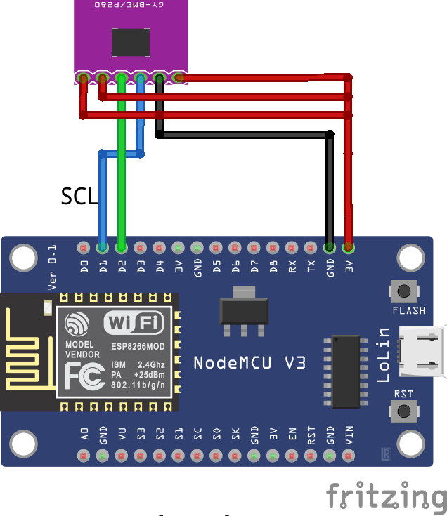
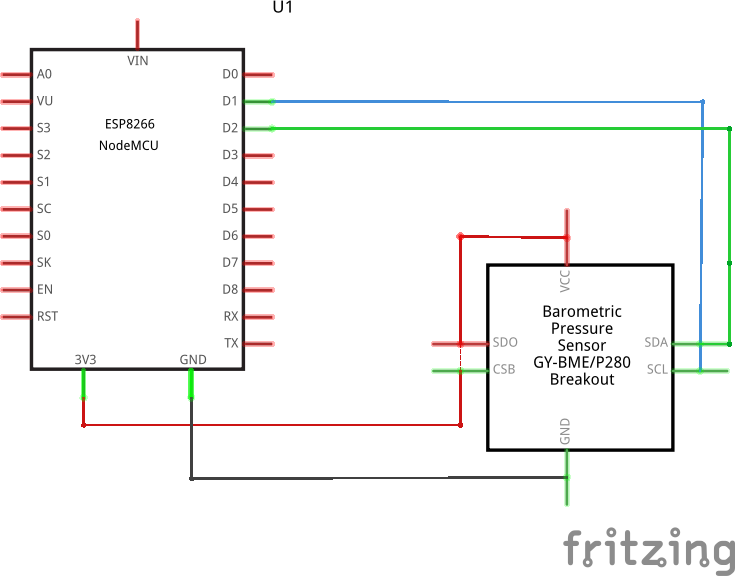

# Read pressure using GY-BMP280

Read values from a GY-BMP280 sensor and print pressure in hPa.

### Diagram

### Schema

  

### Pressure conversion table  

|   UNIT    |     bar     |     Pa    | atm (Kp/cm2) | Torr (mmHg) |     psi      |   mm WS   |
|:---------:|:-----------:|:---------:|:------------:|:-----------:|:------------:|:---------:|
|  **bar**  |      1      |    10^5   |     1.02     |     750     |     14.5     | 1.02x10^4 |
|   **Pa**  |    10^-5    |     1     |  1.02x10^-5  |  7.5x10^-3  |  14.5x10^-5  |   0.102   |
|  **atm**  |    0.981    | 9.81x10^4 |       1      |     736     |    14.22     |    10^4   |
|  **Torr** | 1.333x10^-3 |   133.32  |  1.36x10^-3  |      1      |  1.934x10^-2 |    13.6   |
|  **psi**  | 6.895x10^-2 |    6895   |  7.031x10^-2 |     51.7    |      1       |   703.1   |
| **mm WS** |  9.81x10^-5 |    9.81   |     10^-4    |  7.36x10^-2 | 1.422x10^-3  |     1     | 

Source: <http://www.reitec.es/Pdf/tabla2.pdf>  

  - **bar** : bar
  - **Pa** : pascal
  - **atm** : atmosphere
  - **Torr** : torr
  - **psi** : pound-force per square inch
  - **mm WS** : millimeter water column (*Millimeter Wassersäule*)
