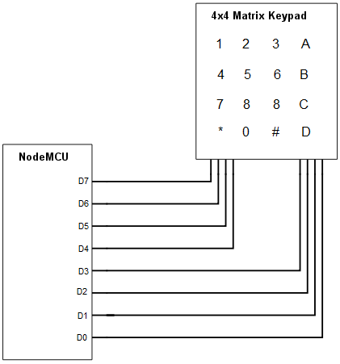

# Keypad Module

- [ACCESS_CONTROL.ino](ACCESS_CONTROL.ino)
Anti-intrusion Security branch of the IoT
Access control by alphanumeric password, using a 4x4 keypad.
In the example 2 LEDs have been used as actuators, one green LED lights up for 2 seconds if the password is correct; and one red LED lights up for 2 seconds if the password is incorrect.
Another possible installation is using a servo motor, so that it acts like a door lock. Until the correct password is entered, the servo does not act.

