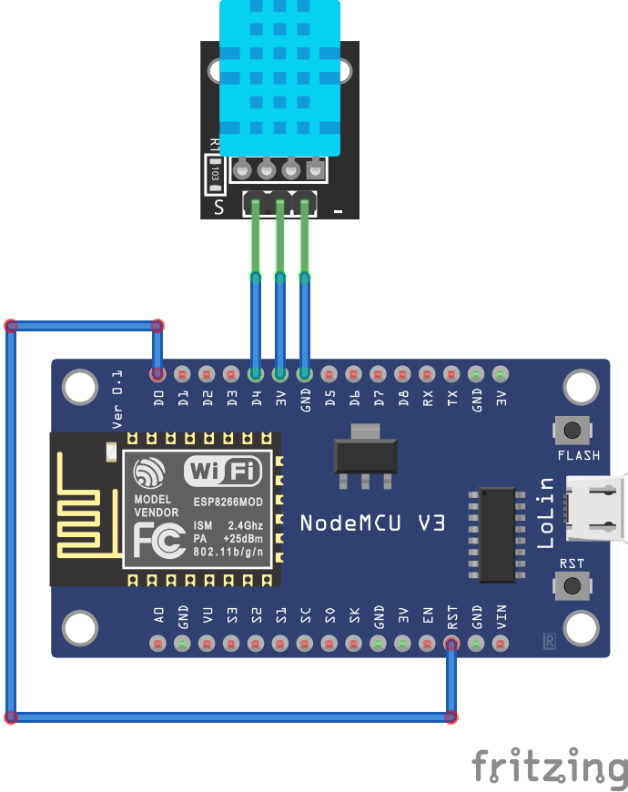

# MQTT-WIFI-DHT11

Read temperature and humidity from DHT11 connected to NodeMCU and send the data through MQTT to a Raspberry Pi. 

> Optionally, you can use the provided Raspberry Pi client written using Node.js to listen for the MQTT messages and to send them to ThingsBoard.

