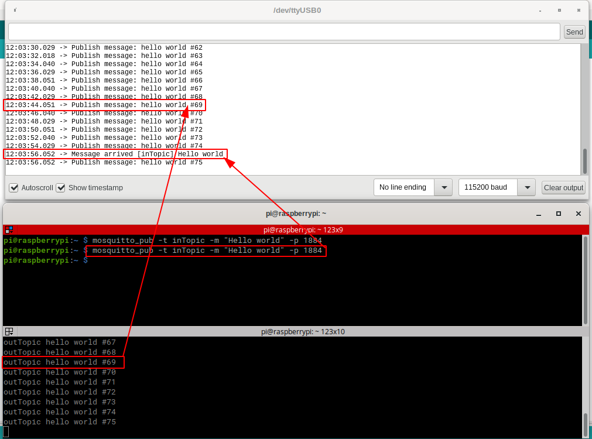

# MQTT NodeMCU & Raspberry Pi

Send and receive messages to/from a Raspberry Pi



### Requirements

```
1 x NodeMCU
1 x Micro USB (C)
1 x Raspberry Pi
1 x Laptop
```

### Raspberry Pi setup

Install Mosquitto

```sh
$ sudo apt install -y mosquitto mosquitto-clients
```

Configure Mosquitto

```sh
$ cat /etc/mosquitto/mosquitto.conf 

# Default settings
pid_file /var/run/mosquitto.pid
persistence true
persistence_location /var/lib/mosquitto/
log_dest file /var/log/mosquitto/mosquitto.log
include_dir /etc/mosquitto/conf.d

# Added settings
listener 1884
allow_anonymous true
```

### Send message from Raspberry Pi to NodeMCU

```sh
$ mosquitto_pub -t inTopic -m "Hello world from Raspberry Pi" -p 1884
```

### Subscribe to messages from NodeMCU to Raspberry Pi

```sh
$ mosquitto_sub  -v -t outTopic -p 1884
```

It should print

```
outTopic hello world #1
outTopic hello world #2
outTopic hello world #3
...
```
