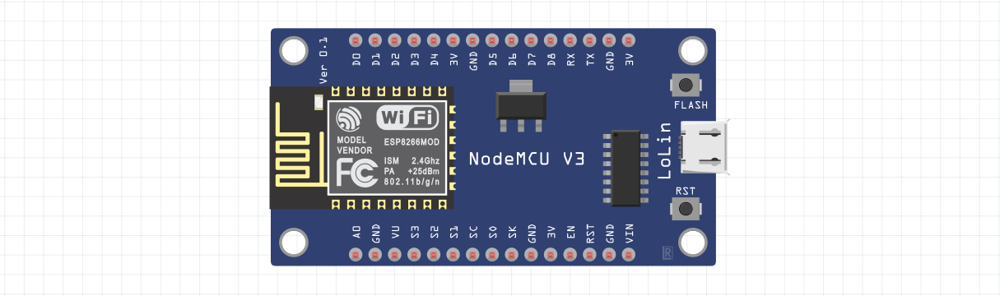

# NodeMCU utilities

> :warning: This repository is just for the hobby and, probably, poorly maintained. 

If you are interested on learning, you may want to visit some other places:

- https://www.arduino.cc/
- https://www.hackster.io/
- https://www.allaboutcircuits.com/
- https://nodemcu.readthedocs.io/
- https://diygeeks.org/

# Table of contents

- **Temperature and humidity**
    - [DHT11](DHT11/)
    - [MQTT-WIFI-DHT11](MQTT-WIFI-DHT11/)
- **Networking**
    - [Wi-Fi](WIFI/)
    - [MQTT](MQTT/)
- **LCD**
    - [LCD](LCD/)

## Contribute

Feel free to add your examples or to create issues. Just follow this structure when adding examples:

- README.md
  - What it does and components used.
- Fritzing-like diagram (PNG) which exactly matches with the provided code.
- The code in a `.ino` file.
